# Investment Flow Diagram - Debits & Credits

This diagram shows all the investment flows, debits, and credits in the distributed inventory sharing network smart contract system.

## Complete Investment Flow

```mermaid
graph TB
    subgraph "User Actions & Payments"
        A[Borrower Pays 2x-3x Shipping Cost] --> B[Payment Breakdown]
        C[Early Return Payment] --> D[Shipback Cost Calculation]
        E[Next Shipper Request] --> F[Request Payment]
        G[Buyout Payment] --> H[Ownership Transfer]
    end
    
    subgraph "Payment Breakdown (2x-3x Model)"
        B --> I[1x Shipping Cost → Shipping Fund]
        B --> J[1x Shipping Cost → Security Deposit]
        B --> K[0-1x Additional → Protection Fund]
    end
    
    subgraph "Shipping Fund Management"
        I --> L[Shipping Fund Pool]
        L --> M[Pay for Return Shipping]
        L --> N[Pay for Next Shipper Transfer]
        L --> O[Owner Withdrawal for Actual Shipping]
    end
    
    subgraph "Security Deposit Handling"
        J --> P[Security Deposit Pool]
        P --> Q[Refund on Normal Return]
        P --> R[Refund on Early Return]
        P --> S[Forfeit on Item Lost]
        S --> T[Transfer to Item Owner]
    end
    
    subgraph "Protection Fund Management"
        K --> U[Additional Protection Pool]
        U --> V[Refund on Normal Return]
        U --> W[Refund on Early Return]
        U --> X[Forfeit on Item Lost]
        X --> Y[Transfer to Item Owner]
    end
    
    subgraph "Early Return Flows"
        D --> Z[Shipback Cost Calculation]
        Z --> AA[Use Shipping Fund or Borrower Pays]
        AA --> BB[Calculate Excess Payment]
        BB --> CC{Dispute Active?}
        CC -->|Yes| DD[Excess to Item Owner]
        CC -->|No| EE[Excess to Borrower]
    end
    
    subgraph "Next Shipper Transfer"
        F --> FF[Request Payment Held]
        FF --> GG[Accept Request]
        GG --> HH[Refund Previous Holder]
        HH --> II[Set New Holder Deposits]
        II --> JJ[Update Shipping Fund]
    end
    
    subgraph "Buyout Transaction"
        H --> KK[Full Payment to Item Owner]
        KK --> LL[Transfer Item Ownership]
        LL --> MM[Refund Any Existing Deposits]
    end
    
    subgraph "Investment Returns & Dividends"
        L --> NN[Shipping Fund Investment Pool]
        NN --> OO[Generate Returns]
        OO --> PP[Distribute to Item Owners]
        PP --> QQ[Monthly Dividend Payments]
        
        U --> RR[Protection Fund Investment Pool]
        RR --> SS[Generate Returns]
        SS --> TT[Distribute to Platform]
        TT --> UU[Platform Development Fund]
    end
    
    subgraph "Reputation & Penalties"
        S --> VV[Reputation Penalty]
        VV --> WW[User Suspension]
        X --> XX[Additional Reputation Penalty]
        XX --> WW
        
        Q --> YY[Reputation Bonus]
        R --> YY
    end
    
    subgraph "Auto-Return System"
        ZZ[Auto-Return Triggered] --> AAA[Use Shipping Fund for Return]
        AAA --> BBB[Refund All Deposits]
        BBB --> CCC[No Additional Cost to Borrower]
    end
    
    %% Styling
    classDef payment fill:#e1f5fe
    classDef fund fill:#f3e5f5
    classDef refund fill:#e8f5e8
    classDef penalty fill:#ffcdd2
    classDef investment fill:#fff3e0
    
    class A,C,E,G payment
    class I,J,K,L,P,U fund
    class Q,R,V,W,HH,MM,BBB refund
    class S,X,VV,XX penalty
    class NN,RR,OO,SS investment
```

## Detailed Flow Breakdown

### 1. Initial Lending Payment (Debit from Borrower)
- **Borrower pays**: 2x-3x shipping cost
- **Breakdown**:
  - 1x → Shipping Fund (for return shipping)
  - 1x → Security Deposit (held as collateral)
  - 0-1x → Additional Protection (optional)

### 2. Shipping Fund Credits
- **Credits to Shipping Fund**: 1x shipping cost per lending
- **Debits from Shipping Fund**:
  - Return shipping costs
  - Next shipper transfer costs
  - Auto-return shipping costs
  - Owner withdrawals for actual shipping

### 3. Security Deposit Credits
- **Credits to Security Deposit**: 1x shipping cost per lending
- **Debits from Security Deposit**:
  - Refunds on normal returns
  - Refunds on early returns
  - Forfeiture to item owner on loss

### 4. Protection Fund Credits
- **Credits to Protection Fund**: 0-1x shipping cost (if 3x payment)
- **Debits from Protection Fund**:
  - Refunds on normal returns
  - Refunds on early returns
  - Forfeiture to item owner on loss

### 5. Early Return Flows
- **Borrower pays**: Shipback cost
- **Shipping Fund debits**: Used for return shipping
- **Excess handling**:
  - If dispute active → Item owner receives excess
  - If no dispute → Borrower receives excess

### 6. Next Shipper Transfer
- **Requester pays**: 2x-3x shipping cost
- **Previous holder debits**: Full refund of deposits
- **New holder credits**: New security + protection deposits
- **Shipping fund**: Updated with new 1x contribution

### 7. Buyout Transaction
- **Buyer pays**: Full buyout price
- **Item owner credits**: Full buyout amount
- **Existing borrower debits**: Refund of any deposits

### 8. Investment Returns
- **Shipping Fund investments**: Generate returns distributed to item owners
- **Protection Fund investments**: Generate returns for platform development
- **Dividend payments**: Monthly distributions based on activity and reputation

### 9. Penalties & Forfeitures
- **Item loss**: Security + protection deposits forfeited to item owner
- **Reputation penalties**: Applied for late returns or losses
- **User suspension**: Temporary suspension for violations

### 10. Auto-Return System
- **Shipping fund debits**: Covers return shipping cost
- **Borrower credits**: Full refund of deposits
- **No additional cost**: To borrower for auto-returns

## Key Financial Principles

1. **Pay-It-Forward Model**: Shipping funds from one borrower pay for the next borrower's shipping
2. **Double Security**: 2x minimum payment ensures both shipping and security coverage
3. **Optional Protection**: 3x payment provides additional protection layer
4. **Investment Returns**: Idle funds generate returns for platform participants
5. **Fair Distribution**: Excess payments and penalties distributed fairly based on circumstances
6. **Auto-Return Protection**: Shipping fund covers unexpected returns without borrower cost

This system ensures sustainable funding for shipping costs while providing security and generating investment returns for platform participants. 