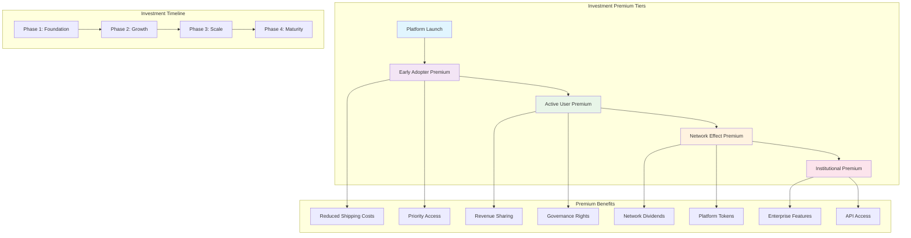
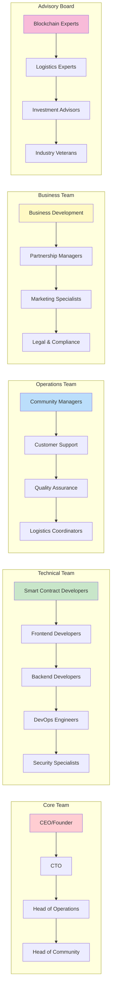
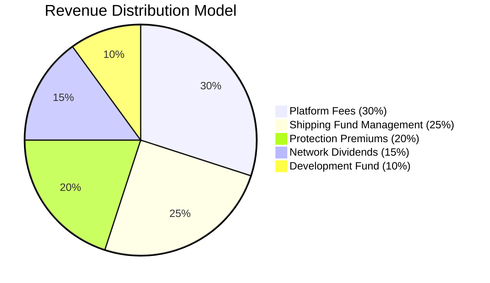
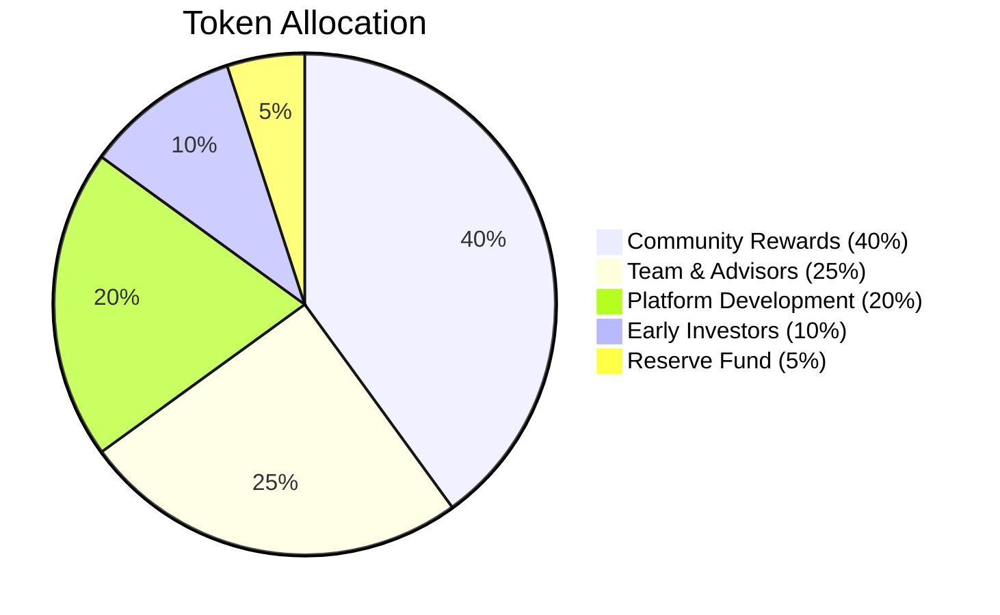
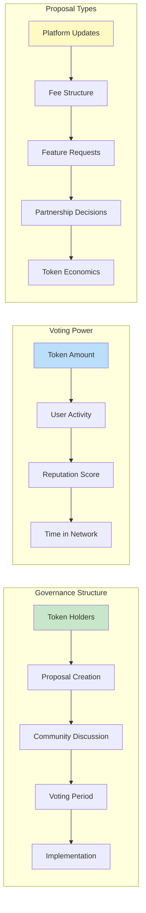
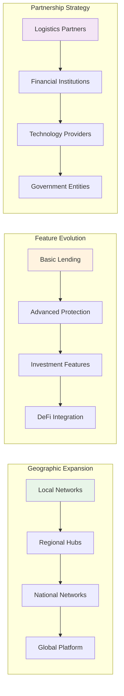
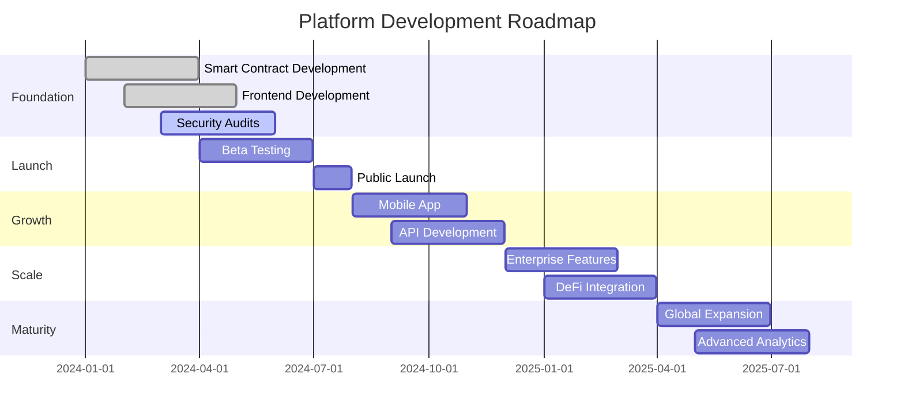

# Investment Structure & Organizational Model

## Overview

The distributed inventory sharing network operates on a sophisticated investment premium system that rewards early adopters, active participants, and platform contributors while maintaining sustainable growth and fair value distribution.

## Investment Premium Structure

## Employee & Contributor Model

## Revenue & Token Distribution

## Investment Premium Details

### Early Adopter Premium (Phase 1)
- **Timeline**: First 6 months post-launch
- **Benefits**:
  - 50% reduced shipping costs
  - Priority access to new features
  - Governance token airdrops
  - Exclusive early access to premium items
- **Investment Required**: Active participation + minimum 10 successful transactions

### Active User Premium (Phase 2)
- **Timeline**: Months 7-18
- **Benefits**:
  - 25% reduced shipping costs
  - Revenue sharing from platform fees
  - Voting rights on platform decisions
  - Access to advanced analytics
- **Investment Required**: 50+ successful transactions + positive reputation score

### Network Effect Premium (Phase 3)
- **Timeline**: Months 19-36
- **Benefits**:
  - Network dividends based on platform growth
  - Platform token rewards
  - Early access to enterprise features
  - Referral bonuses
- **Investment Required**: 100+ transactions + community contributions

### Institutional Premium (Phase 4)
- **Timeline**: Month 37+
- **Benefits**:
  - Enterprise API access
  - Custom integration support
  - Bulk transaction discounts
  - Dedicated account management
- **Investment Required**: Large volume transactions + partnership agreements

## Employee Compensation Structure

```mermaid
graph TB
    subgraph "Compensation Components"
        A[Base Salary] --> B[Performance Bonuses]
        B --> C[Equity Grants]
        C --> D[Token Rewards]
        D --> E[Network Dividends]
    end
    
    subgraph "Performance Metrics"
        F[Platform Growth] --> G[User Satisfaction]
        G --> H[Technical Excellence]
        H --> I[Community Engagement]
        I --> J[Revenue Generation]
    end
    
    subgraph "Equity Vesting"
        K[4 Year Vesting] --> L[1 Year Cliff]
        L --> M[Monthly Vesting]
        M --> N[Performance Acceleration]
    end
    
    style A fill:#e8f5e8
    style B fill:#fff3e0
    style C fill:#f3e5f5
    style D fill:#e1f5fe
    style E fill:#fce4ec
```

## Governance & Decision Making

## Risk Management & Insurance

```mermaid
graph TB
    subgraph "Risk Mitigation"
        A[Smart Contract Audits] --> B[Insurance Pools]
        B --> C[Dispute Resolution]
        C --> D[Reputation Systems]
        D --> E[Legal Framework]
    end
    
    subgraph "Insurance Structure"
        F[User Protection Fund] --> G[Platform Insurance]
        G --> H[Third-Party Coverage]
        H --> I[Catastrophic Loss Pool]
    end
    
    subgraph "Dispute Resolution"
        J[Community Mediation] --> K[Expert Arbitration]
        K --> L[Smart Contract Enforcement]
        L --> M[Legal Recourse]
    end
    
    style A fill:#ffcdd2
    style F fill:#c8e6c9
    style J fill:#bbdefb
```

## Growth & Scaling Strategy

## Key Performance Indicators (KPIs)

```mermaid
graph TB
    subgraph "Platform Metrics"
        A[Total Value Locked] --> B[Transaction Volume]
        B --> C[User Growth Rate]
        C --> D[Network Effect Score]
    end
    
    subgraph "Financial Metrics"
        E[Revenue Growth] --> F[Profit Margins]
        F --> G[Customer Lifetime Value]
        G --> H[Platform Efficiency]
    end
    
    subgraph "Community Metrics"
        I[User Satisfaction] --> J[Community Engagement]
        J --> K[Dispute Resolution Rate]
        K --> L[Network Trust Score]
    end
    
    style A fill:#c8e6c9
    style E fill:#bbdefb
    style I fill:#fff9c4
```

## Future Roadmap

This comprehensive structure provides a clear framework for investment premiums, employee compensation, and organizational growth while maintaining transparency and fairness for all participants in the distributed inventory sharing network. 