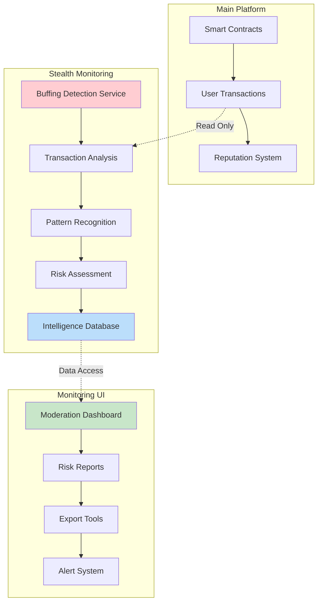

# Stealth Buffing Detection System

## Overview

The stealth buffing detection system is a completely independent monitoring platform that observes the distributed inventory sharing network for suspicious patterns without affecting user reputation or marking accounts. It's designed to build intelligence over time while allowing legitimate family networks and close social circles to operate normally.

> *"We leave this as an interesting if intimidating copse of trees, and later, in the dead of winter, we can venture out and see what looms in the snow covered hovel."*

## Key Principles

### 1. **Complete Independence**
- No impact on main platform reputation systems
- No account marking or suspension
- Separate data storage and analysis
- Unlinked indexes and monitoring

### 2. **Family Network Awareness**
- Recognizes that moms, nieces, daughters, sons, nephews, uncles, aunts, dads, friends, and cousins create legitimate "suspicious" patterns
- Avoids false positives from close social circles
- Builds intelligence without interfering with natural network growth

### 3. **Stealth Operation**
- Runs in background without user awareness
- Collects data for analysis only
- No visible indicators or warnings to users
- Pure monitoring and intelligence gathering

## Architecture

### Core Components



### Detection Algorithms

#### 1. **Kalman Filters**
- **Purpose**: Real-time reputation tracking and anomaly detection
- **Advantage**: Handles noisy data and detects sudden reputation jumps
- **Configuration**: 
  - Process noise (Q): 0.1
  - Measurement noise (R): 0.5
  - Threshold: 20 reputation points

#### 2. **Behavioral Clustering (KNN)**
- **Purpose**: Pattern recognition and behavioral analysis
- **Features**:
  - Transaction frequency
  - Reputation growth rate
  - Transaction value variance
  - Time pattern regularity
  - Network connectivity
- **Threshold**: 0.3 distance for anomaly detection

#### 3. **Network Graph Analysis**
- **Purpose**: Collusion and circular lending detection
- **Patterns Detected**:
  - Circular lending rings
  - Hub-and-spoke networks
  - Frequent trading with same users
  - Star patterns
- **Risk Threshold**: 0.7 for collusion detection

#### 4. **Temporal Analysis**
- **Purpose**: Time-based anomaly detection
- **Methods**:
  - Trend analysis
  - Seasonal decomposition
  - Sudden activity spikes
  - Irregular timing patterns

## Risk Scoring System

### Composite Risk Score
```typescript
riskScore = (
  kalmanAnomaly * 0.30 +      // 30% weight
  behavioralAnomaly * 0.25 +  // 25% weight
  networkCollusion * 0.30 +   // 30% weight
  temporalAnomaly * 0.15      // 15% weight
)
```

### Risk Levels
- **Low Risk**: 0.0 - 0.5 (Monitor)
- **Medium Risk**: 0.5 - 0.8 (Investigate)
- **High Risk**: 0.8 - 1.0 (Alert)

### Confidence Scoring
- **Data Points**: More transactions = higher confidence
- **Flag Consistency**: Multiple flags = higher confidence
- **Time Span**: Longer history = higher confidence

## Integration Guide

### 1. **Basic Transaction Monitoring**

```typescript
import { BuffingDetectionExample } from './BuffingDetectionExample';

// Monitor a lending transaction
const analysis = await BuffingDetectionExample.monitorTransaction(
  borrowerAddress,
  'borrow',
  lenderAddress,
  itemId,
  shippingCost,
  additionalProtection,
  reputationChange
);

if (analysis.isFlagged) {
  console.log(`High risk user: ${analysis.userId}`);
  console.log(`Risk score: ${(analysis.riskScore * 100).toFixed(1)}%`);
}
```

### 2. **Dashboard Integration**

```typescript
// Get monitoring statistics
const dashboardData = BuffingDetectionExample.getDashboardData();

console.log('Total users monitored:', dashboardData.overview.totalUsers);
console.log('High risk users:', dashboardData.overview.highRiskUsers);
console.log('Collusion rings detected:', dashboardData.overview.collusionRings);
```

### 3. **Export and Analysis**

```typescript
// Export user analysis for external review
BuffingDetectionExample.exportUserAnalysis(userAddress);

// Get detailed analysis
const analysis = buffingDetectionService.exportAnalysis(userAddress);
```

## Monitoring Dashboard

### Features
- **Real-time Statistics**: Total users, high-risk users, collusion rings
- **Risk User Table**: Detailed view of flagged users with risk scores
- **Collusion Ring Detection**: Visual representation of suspicious networks
- **Export Capabilities**: JSON export for external analysis
- **Alert System**: Configurable notifications for high-risk activities

### Access Control
- **Admin Only**: Dashboard access restricted to platform administrators
- **Read-Only**: No ability to modify user reputation or status
- **Audit Trail**: All monitoring activities logged for transparency

## Alert System

### Alert Types
1. **High Risk User Detection**
   - Risk score > 0.8
   - Multiple flags triggered
   - High confidence level

2. **Collusion Ring Detection**
   - Circular lending patterns
   - Hub-and-spoke networks
   - Frequent trading rings

3. **Behavioral Anomalies**
   - Unusual transaction patterns
   - Reputation manipulation attempts
   - Temporal irregularities

### Alert Channels
- **Console Logging**: Development and debugging
- **Webhook Integration**: Slack, Discord, email
- **Dashboard Notifications**: Real-time UI updates
- **External APIs**: Integration with monitoring services

## Data Privacy and Security

### Data Collection
- **Transaction Data**: Type, amount, counterparty, timestamp
- **Reputation History**: Changes over time
- **Network Connections**: User interaction patterns
- **Behavioral Metrics**: Transaction frequency, patterns

### Data Storage
- **Local Storage**: All data stored locally in browser
- **No External Servers**: No data sent to external services
- **Temporary**: Data cleared on page refresh (configurable)
- **Export Only**: Data only exported when explicitly requested

### Privacy Protection
- **No PII**: No personal information collected
- **Address Masking**: User addresses partially masked in UI
- **Consent Based**: Only monitors transactions that occur
- **Transparent**: Clear documentation of what is monitored

## Future Enhancements

### Phase 1: Foundation (Current)
- Basic detection algorithms
- Simple dashboard
- Export capabilities
- Console logging

### Phase 2: Advanced Detection
- Machine learning models
- Graph neural networks
- Advanced pattern recognition
- Predictive analytics

### Phase 3: Integration
- External monitoring services
- API integrations
- Advanced alerting
- Automated reporting

### Phase 4: Intelligence
- Cross-platform analysis
- Industry benchmarking
- Predictive modeling
- Automated response systems

## Usage Examples

### Integration with InventoryService

```typescript
// In your InventoryService.ts
import { BuffingDetectionExample } from './BuffingDetectionExample';

export class InventoryService {
  async lendItem(itemId: string, borrower: string) {
    // Existing lending logic
    const result = await this.contract.lendItem(itemId, { value: payment });
    
    // Stealth monitoring (doesn't affect the transaction)
    BuffingDetectionExample.monitorTransaction(
      borrower,
      'borrow',
      this.currentUser.address,
      itemId,
      shippingCost,
      additionalProtection,
      reputationChange
    );
    
    return result;
  }
}
```

### Dashboard Component

```typescript
// In your dashboard component
import { BuffingDetectionExample } from './BuffingDetectionExample';

const DashboardComponent = () => {
  const [monitoringData, setMonitoringData] = useState(null);
  
  useEffect(() => {
    const data = BuffingDetectionExample.getDashboardData();
    setMonitoringData(data);
  }, []);
  
  return (
    <div>
      <h2>Stealth Monitoring Dashboard</h2>
      <p>Total Users: {monitoringData?.overview.totalUsers}</p>
      <p>High Risk Users: {monitoringData?.overview.highRiskUsers}</p>
      {/* More dashboard content */}
    </div>
  );
};
```

## Configuration

### Detection Thresholds
```typescript
const CONFIG = {
  KALMAN_Q: 0.1,              // Process noise
  KALMAN_R: 0.5,              // Measurement noise
  RISK_THRESHOLD: 0.7,        // Risk threshold for flagging
  MIN_CONFIDENCE: 0.6,        // Minimum confidence for alerts
  BEHAVIORAL_DISTANCE: 0.3,   // Behavioral anomaly threshold
  COLLUSION_RISK: 0.7,        // Collusion detection threshold
  TEMPORAL_THRESHOLD: 20      // Temporal anomaly threshold
};
```

### Alert Configuration
```typescript
const ALERT_CONFIG = {
  ENABLE_CONSOLE_LOGGING: true,
  ENABLE_WEBHOOKS: false,
  ENABLE_DASHBOARD_ALERTS: true,
  MIN_RISK_SCORE_FOR_ALERT: 0.8,
  ALERT_COOLDOWN_MINUTES: 30
};
```

## Conclusion

The stealth buffing detection system provides comprehensive monitoring capabilities while respecting the natural growth of family and social networks. It operates completely independently, building intelligence over time without interfering with legitimate user activities.

When the time comes to "venture out in the dead of winter," this system will provide the insights needed to identify and address any genuine buffing attempts while preserving the trust and community aspects of the platform.

---

*"The best defense is invisible defense."* 